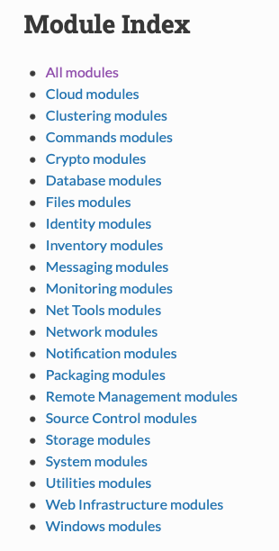

# Lab 3: Modules

Modules are the basis for all of the commands that Ansible can run.  These modules are maintained by the Red Hat open source community, and can be viewed in a couple of different ways.  In this lab, we will review how to find the correct module for the task at hand.

Duration: 10-15 minutes

- Task 1: Use the ansible-doc command to find modules
- Task 2: Use the Ansible docs to search for modules
- Task 3: Review


## Task 1: Use the ansible-doc command to find modules
The Ansible command line utility has built in functionality that allows you to do a search for commands on the fly.  Let's take a look at how this works.

### Step 3.1.1
`ansible-doc` is the CLI utility used to look up modules.  The most common option for searching for modules is `-l` , or `--list`.  Running this command by itself will return every available module, so we'll need to pare it down a bit to make it useful.  

Let's search for a module that will allow us to `copy` a file from our local machine onto our remote target host.  We'll use the Linux command `grep` to filter through the results to fine what we're looking for:

```shell
 ansible-doc -l | grep copy
vsphere_copy                                                  Copy a file to a VMware datastore                                                                                                                      
win_copy                                                      Copies files to remote locations on windows hosts                                                                                                      
bigip_file_copy                                               Manage files in datastores on a BIG-IP                                                                                                                 
ec2_ami_copy                                                  copies AMI between AWS regions, return new image id                                                                                                    
win_robocopy                                                  Synchronizes the contents of two directories using Robocopy                                                                                            
copy                                                          Copy files to remote locations                                                                                                                         
na_ontap_lun_copy                                             NetApp ONTAP copy LUNs                                                                                                                                 
icx_copy                                                      Transfer files from or to remote Ruckus ICX 7000 series switches                                                                                       
unarchive                                                     Unpacks an archive after (optionally) copying it from the local machine                                                                                
ce_file_copy                                                  Copy a file to a remote cloudengine device over SCP on HUAWEI CloudEngine switches                                                                     
postgresql_copy                                               Copy data between a file/program and a PostgreSQL table                                                                                                
ec2_snapshot_copy                                             copies an EC2 snapshot and returns the new Snapshot ID                                                                                                 
nxos_file_copy                                                Copy a file to a remote NXOS device                                                                                                                    
netapp_e_volume_copy                                          NetApp E-Series create volume copy pairs    
```
As you can see here, we were able to filter through the list of all availble Ansible modules and only return results that contain the keyword `copy`.  This turns our list of options from hundreds of options down to a small handful.  If you're still unsure as to which one we're looking for and you're comfortable with your Linux piplines, you can pair this down a bit more with multiple grep commands.  Let's try filtering on both the keyword `copy` and `remote`, since we're trying to copy a file to a remote location:

```shell
ansible-doc -l | grep copy | grep remote
win_copy                                                      Copies files to remote locations on windows hosts                                                                                                      
copy                                                          Copy files to remote locations                                                                                                                         
icx_copy                                                      Transfer files from or to remote Ruckus ICX 7000 series switches                                                                                       
ce_file_copy                                                  Copy a file to a remote cloudengine device over SCP on HUAWEI CloudEngine switches                                                                     
nxos_file_copy                                                Copy a file to a remote NXOS device
```

As you can see here, this returned even fewer results that are easy to read through.  Judging by these results, we can see that the module that we're looking for is just simply called `copy`.

## Step 3.1.2
Now that we've located our module via the CLI, let's find out some more information on how to invoke it on the command line.  To do this, we will simply run the same `ansible-doc` command, but this time we'll just feed it the `copy` input in order to get information on it.  That command looks like this:

```shell
ansible-doc copy
> COPY    (/usr/lib/python2.7/dist-packages/ansible/modules/files/copy.py)

        The `copy' module copies a file from the local or remote machine to a location on the remote machine. Use the [fetch] module to copy files from remote locations to
        the local box. If you need variable interpolation in copied files, use the [template] module. Using a variable in the `content' field will result in unpredictable
        output. For Windows targets, use the [win_copy] module instead.

  * This module is maintained by The Ansible Core Team
  * note: This module has a corresponding action plugin.

OPTIONS (= is mandatory):

#....output abridged for the lab...#
```
You should see the full print out of the `copy` manual page on your terminal.  This will tell you everything option that you can pass on the command line.  

Pay special attention to the line `OPTIONS (= is mandatory):`, at this is telling you which of the options you MUST include in order for the module to function correctly.  From viewing the manual for `copy`, we can see that it only has `dest` as mandatory.

## Task 2: Use the Ansible docs to search for modules
With all of that said, it's possible that you prefer to use a web browser to find information about your modules.  Fortunately, Ansible hosts a documentation page that also lists all of this information.

### Step 3.2.1
Navigate the to following URL:
- https://docs.ansible.com/ansible/2.9/modules/modules_by_category.html

This will take you to the official Ansible module documentation page.  Here, you will see an index that contain all of the different categories of modules:
- 

Here, you can drill down a bit to do a search for all of the different modules that are available.  Since `copy` deals with files, the `Files` category is a good place to start.

Navigating there, you will see that `copy` does live here, along with all of the rest of the modules that deal with file manipulation.

## Task 3: Review
Now that we know where all of these module live, take some time to think of some commands that you might need to Ansible to perform for you.  Use both the CLI and the online documentation portal to search for these so that you can get a feel for which method will fit into your workflow better.  

It is important now that we become familiar with modules, as they are the building blocks for which the next few lessons are built upon.